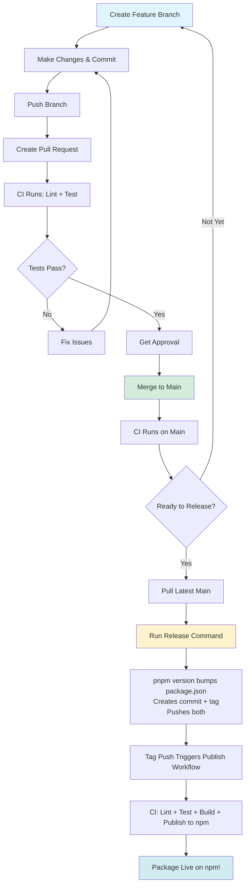

# Release Workflow

## Overview

This project uses a tag-triggered release workflow. Features accumulate on `main` branch, and you control when to cut a release and what version to bump. CI automatically publishes to npm when it detects a version tag.

## Workflow Diagram



## Day-to-Day Development

### 1. Create Feature Branch

```bash
git checkout main
git pull
git checkout -b feature/descriptive-name
```

### 2. Make Changes

Edit files, add features, fix bugs. Commit as you go:

```bash
git add .
git commit -m "Add feature description"
```

**Important:** Never change `package.json` version in feature branches.

### 3. Push and Create PR

```bash
git push origin feature/descriptive-name
```

Go to GitHub and create a Pull Request targeting `main`.

### 4. CI Runs Automatically

The CI workflow runs on your PR:
- Runs ESLint
- Runs all tests
- Must pass before merge

### 5. Get Approval and Merge

After review and CI passes, merge the PR to `main`. The feature is now in `main` but not yet released.

## Release Process

### When to Release

Release when you're ready to publish changes to npm. You can:
- Release after every feature merge
- Accumulate multiple features and release together
- Release on a schedule (weekly, monthly, etc.)

It's entirely up to you.

### Choosing Version Bump Type

Follow [Semantic Versioning](https://semver.org/):

- **Patch** (1.0.0 → 1.0.1): Bug fixes, typos, minor changes
- **Minor** (1.0.0 → 1.1.0): New features, non-breaking changes
- **Major** (1.0.0 → 2.0.0): Breaking changes, API changes

### Release Commands

1. **Ensure you're on latest main:**

```bash
git checkout main
git pull
```

2. **Run the appropriate release command:**

```bash
# For bug fixes and minor updates
pnpm release:patch

# For new features
pnpm release:minor

# For breaking changes
pnpm release:major
```

3. **That's it!** The command will:
   - Update `package.json` version
   - Create a commit: "1.0.1"
   - Create a git tag: "v1.0.1"
   - Push both commit and tag to GitHub

4. **GitHub Actions automatically:**
   - Detects the tag push
   - Runs lint + test + build
   - Publishes to npm with provenance
   - Package appears on npm within ~1 minute

### Verify Release

Check that your package was published:

```bash
npm view @d1g1tal/watchr version
```

Or visit: https://www.npmjs.com/package/@d1g1tal/watchr

## What Gets Published

Only these files/folders are included in the npm package (configured in `package.json` `files` field):

- `dist/` - Compiled JavaScript and type definitions
- `README.md` - Documentation
- `LICENSE` - License file
- `package.json` - Package metadata (auto-included)

## GitHub Actions

### CI Workflow (`.github/workflows/ci.yml`)

**Triggers on:**
- Pull requests to `main`
- Pushes to `main`

**Steps:**
1. Install dependencies
2. Run ESLint
3. Run tests

### Publish Workflow (`.github/workflows/publish.yml`)

**Triggers on:**
- Tag pushes matching `v*` (e.g., `v1.0.1`)

**Steps:**
1. Install dependencies
2. Run ESLint
3. Run tests
4. Build project
5. Publish to npm with provenance

**Requirements:**
- npm account with 2FA enabled
- npm token configured as GitHub secret (uses trusted publishing)
- Repository permissions set to write

## Troubleshooting

### "Tag already exists"

If you accidentally ran a release command twice:

```bash
# Delete local tag
git tag -d v1.0.1

# Delete remote tag
git push origin :refs/tags/v1.0.1

# Run release command again
pnpm release:patch
```

### "Working directory not clean"

Commit or stash changes before releasing:

```bash
git status
git stash
# or
git add . && git commit -m "Your changes"
```

### Failed Publish

If the publish workflow fails:
1. Check the GitHub Actions logs
2. Fix the issue (if in code)
3. Create a new patch release with the fix

### Need to Skip a Version?

Manually specify version:

```bash
pnpm version 1.2.5  # Specific version
git push --follow-tags
```

## Best Practices

1. **Always pull before releasing:**
   ```bash
   git checkout main && git pull
   ```

2. **Test locally before releasing:**
   ```bash
   pnpm lint && pnpm test
   ```

3. **Review changes since last release:**
   ```bash
   git log v1.0.0..HEAD --oneline
   ```

4. **Keep changelogs:** Consider maintaining `CHANGELOG.md` manually or with tooling

5. **Don't force push tags:** If you need to fix a release, publish a new patch version

## Quick Reference

| Command | Description |
|---------|-------------|
| `pnpm release:patch` | Bug fixes (1.0.0 → 1.0.1) |
| `pnpm release:minor` | New features (1.0.0 → 1.1.0) |
| `pnpm release:major` | Breaking changes (1.0.0 → 2.0.0) |
| `git tag -l` | List all tags |
| `git log v1.0.0..HEAD` | See commits since last release |
| `npm view @d1g1tal/watchr` | View published package info |

## Emergency Unpublish

If you need to unpublish a version within 72 hours:

```bash
npm unpublish @d1g1tal/watchr@1.0.1
```

**Warning:** Only use for serious issues (security, accidental publish). Prefer deprecation for older versions:

```bash
npm deprecate @d1g1tal/watchr@1.0.1 "Please upgrade to 1.0.2"
```
